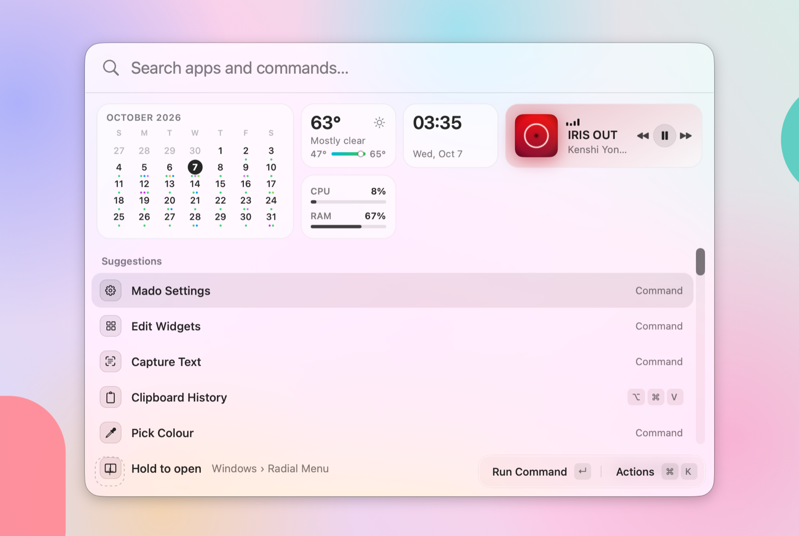
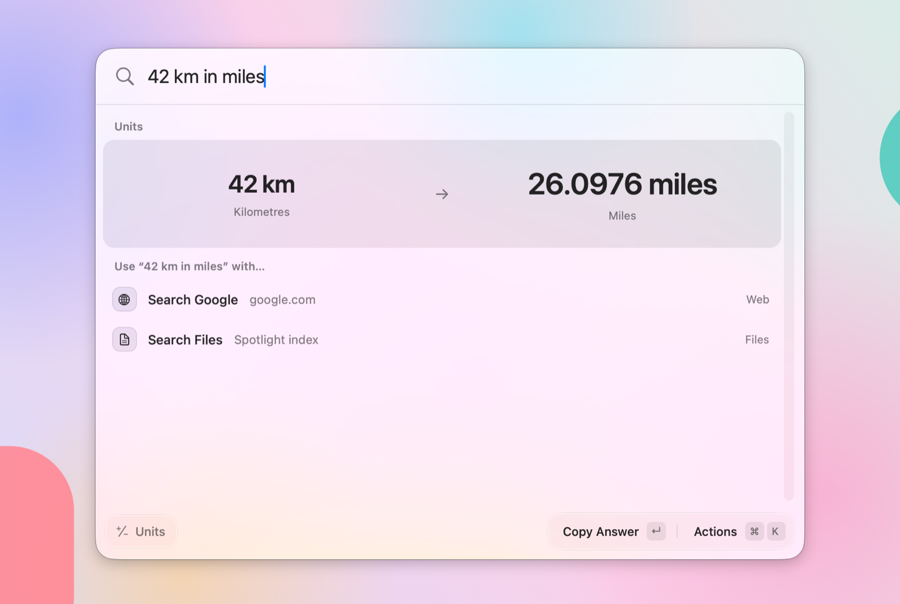

# Mado

  <picture>
    <source media="(prefers-color-scheme: dark)" srcset="docs/images/home-dark.png">
    
  </picture>

Mado is a launcher for macOS that I use every day. Press ⌘Space, type, and get an app, a file, an answer or a setting. It is also where I keep the small utilities I'd otherwise install one by one: window snapping, clipboard history, snippets, keyboard tweaks and dictation.

It is written in AppKit only, with no SwiftUI, and uses Liquid Glass on macOS 26. It still runs on macOS 14 and later, with a plain blur instead of glass.

Mado is still being built. Everything below works today, but expect rough edges, and nothing is notarized yet, so you build it yourself.

## What it does

**Launcher.** Fuzzy search across apps, files (with Quick Look), system commands and Mado's own settings. Give anything an alias, a favourite star or its own hotkey. ⌘K opens the actions for the selected row.

**Answers in the search bar.** A calculator with history, unit and currency conversion, time zones, date maths, colours and a dictionary. Press ↵ to copy the answer or paste it into the app you came from.

  <picture>
    <source media="(prefers-color-scheme: dark)" srcset="docs/images/launcher-dark.png">
    
  </picture>

**Windows.** Snap with hotkeys, press the same key again to cycle sizes, or hold a trigger for the radial menu and drop the window where you point. A window switcher can be opened from the keyboard or with a trackpad swipe, and each app can have its own layout hotkeys.

**Clipboard.** History with pinning, ignored apps, and automatic skipping of things that shouldn't be saved. Snippets that expand as you type, a paste stack, text recognition for copied images, text tools and an emoji picker.

**Keyboard.** Tap a modifier for something else, switch between 英数 and かな with one key, give each app its own input source, make Enter add a new line in chat apps and ⌘↵ send, and turn Caps Lock into a hyper key.

**Dictation.** Speak and Mado types it where your cursor is. You choose the speech model, and it runs on your Mac.

**Widgets.** Calendar, weather, now playing, battery and system meters. They show up as search results, floating outside the launcher panel, or as pills in a status bar. An edit mode lets you rearrange and resize them.

**Menu bar and screen.** Your next event in the menu bar, a join prompt when a meeting starts, a magnifier that picks colours from the screen, and a screen region capture that turns what's in it into text.

## Install

Mado isn't distributed as a download yet. To use it day to day, run this from an up-to-date `main`. It needs Xcode, XcodeGen and a Mac.

    brew install xcodegen swiftlint
    scripts/install.sh

The script builds Release, quits every running Mado (Debug builds included), replaces the copy in `/Applications` and opens it. Turn on Launch at Login in that copy's Settings once. Run the script again to update.

Some features need macOS permissions: Accessibility and Input Monitoring for hotkeys and keyboard tweaks, Screen Recording for screen capture, Microphone for dictation, and Calendars and Location for the calendar and weather widgets.

## Development

    xcodegen generate
    open Mado.xcodeproj

Debug builds are signed with a local certificate named `Mado Development`, so the Accessibility grant survives rebuilds. Create it once per Mac in Keychain Access: Certificate Assistant, Create a Certificate, name `Mado Development`, type Code Signing. Release reads `settings.json` and keeps its own clipboard history, separate from Debug builds. Debug builds also have their own bundle ID (`com.taroj1205.mado.debug`), so macOS asks for their permissions separately from the installed app's, and their defaults and Launch at Login stay apart from it.

To run a Debug build from a worktree next to another Mado, launch it without its hotkeys and open its launcher with a signal instead. The build writes `Mado.ready` next to `Mado.app` once it handles the signal; until then the signal quits it. It also starts with keyboard features paused, so right ⌥, Caps Lock, snippets and other keys reach only the other Mado. To try them in this build, uncheck Pause Keyboard Features in its menu bar icon.

    xcodebuild build -project Mado.xcodeproj -scheme Mado -derivedDataPath build
    rm -f build/Build/Products/Debug/Mado.ready
    open -n build/Build/Products/Debug/Mado.app --args -MadoNoHotKey YES
    until [ -e build/Build/Products/Debug/Mado.ready ]; do sleep 0.1; done
    pkill -USR1 -f "$PWD/build/Build/Products/Debug/"

To let a script drive that launcher while you keep typing in another app, also pass `-MadoNoFocus YES`. The launcher then opens without taking focus, and keys the script posts to the Mado process with `CGEvent.postToPid` reach it as if typed there: the query, arrows, ↵, ⌘↵, ⌘K and Esc, including inside the action panel. Keys posted to `.cghidEventTap` still go to the app you are typing in.

Tests: `xcodebuild test -project Mado.xcodeproj -scheme Mado -destination 'platform=macOS'` runs the app and package tests in one build, which is what CI runs. A single package also runs with `swift test` from its directory.

Branches and commits start with the goal ID, e.g. `M0-01-xcode-project`.

Commit messages follow Conventional Commits with a required scope (`type(scope): summary`), enforced by `.githooks/commit-msg`. Enable it once per clone:

    git config core.hooksPath .githooks

Format with `swift format -i -r App Packages Tests`. The pre-commit hook runs `swift format lint --strict` and `swiftlint lint --strict`; CI runs the same, and every warning is an error.

### Layout

The app lives in `App/`. The rest is split into local packages under `Packages/`:

- `AppCore`: modules, settings, commands, permissions, the shared event tap and the data behind the widgets
- `GlassUI`: the glass panels and widget components
- `InputKit`: hotkeys, modifier taps, key remapping, input sources and Enter Guard
- `WindowKit`: window layouts, the radial menu and the pixel loupe
- `SearchKit`: app and file indexing, fuzzy matching, and the calculator, conversions and other answers
- `ClipboardKit`: clipboard history, snippets, emoji and image text
- `SpeechKit`: dictation and the speech engines

More notes are in [`docs/`](docs).
